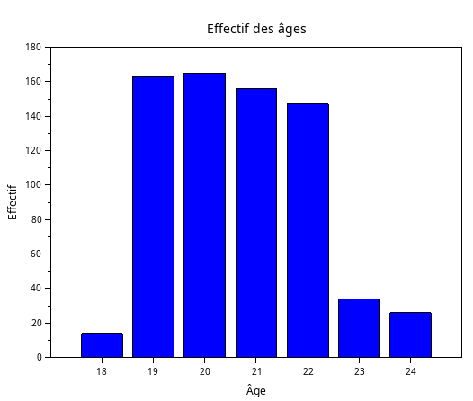
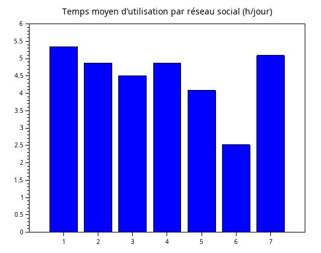

# Exercice 2 : Analyse des usages et caractéristiques des étudiants

## Table des matières
a. [Initialisation des variables](#a-initialisation-des-variables)  
1. [Répartition des âges et des genres](#1-repartition-des-ages-et-des-genres-des-etudiants)  
2. [Effectifs des 10 premiers pays](#2-effectifs-des-10-premiers-pays)  
3. [Effectifs des niveaux scolaires](#3-effectifs-des-niveaux-scolaires)  
4. [Distribution du temps moyen d'utilisation des réseaux sociaux](#4-distribution-du-temps-moyen-dutilisation-des-réseaux-sociaux)  
5. [Effectifs des plateformes les plus utilisées (ordre décroissant)](#5-effectifs-des-plateformes-les-plus-utilisées)  

---


## a. Initialisation des variables

```scilab
csv = csvRead('data.csv',',');
data = csvRead('data.csv', ",", [], "string") 
```


## 1: Repartition des ages et des genres des etudiants

```scilab
ages = csv(:,2);
tab = tabul(ages);
disp(tab);

bar(tab(:,1), tab(:,2));
xtitle("Effectif des âges", "Âge", "Effectif");
```
Résultat:<br>


La plupart des étudiants de cette étude ont entre 19 et 22 ans.

---

```scilab
genre = data(:,3);
tab = tabul(genre);

total = sum(tab(2)); // somme des effectifs
pourcentages = 100 * tab(2) / total;

labels = tab(1); // "Male", "Female", etc.
for i = 1:size(labels, "*")
    labels(i) = labels(i) + " (" + msprintf("%.1f", pourcentages(i)) + "%)";
end

clf();
pie(tab(2), labels);
xtitle("Répartition des genres avec pourcentages");
```
Résultat:<br>


On remarque que pour cette étude, il y a presque autant d'hommes que de femmes.

## 2: Effectifs des 10 premiers pays
```scilab
pays = data(:,5);
premierspays = ["Bangladesh", "India", "USA", "UK", "Canada", "Australia", "Germany", "Brazil", "Japan", "South Korea"];
n = size(premierspays, 2);
effectifs = zeros(1, n);
for i = 1:n
    effectifs(i) = sum(pays == premierspays(i));
end
disp([premierspays' string(effectifs')], "Pays et effectifs");
bar(effectifs);
xtitle("Nombre d etudiants par pays (Top 10)");
```

Résultat:<br>


Numéro   	Pays<br>
1 = Bangladesh<br>
2 = India<br>
3 =	USA  <br>
4 =  UK<br>
5 = Canada<br>
6 =	Australia<br>
7 =	Germany<br>
8 =	Brazil<br>
9 =	Japan<br>
10 = South Korea<br>


## 3: Effectifs des niveaux scolaires
```scilab
niveaux = data(:,4);
categories = ["High School", "Undergraduate", "Graduate"];
effectifs = zeros(1, size(categories, 2));
for i = 1:size(categories, 2)
    effectifs(i) = sum(niveaux == categories(i));
end
disp([categories' string(effectifs')], "Niveau scolaire et effectifs");
clf();
bar(effectifs);
xtitle("Répartition des étudiants par niveau scolaire");
```
Résultat:<br>


1 =	High School<br>
2 =	Undergraduate<br>
3 =	Graduate<br>


Cela peut sembler étonnant que la plupart des étudiants soient au moins au niveau diplômé, mais c'est aussi parce que l'âge des étudiants de cette étude ne descend pas en dessous de 18 ans.


## 4: Distribution du temps moyen d'utilisation des réseaux sociaux
```scilab
plateformes_cibles = ["TikTok", "Instagram", "Facebook", "Twitter", "YouTube", "LinkedIn", "Snapchat"];
temps_txt = data(:,6);
plateformes_raw = data(:,7); 
plateformes = stripblanks(plateformes_raw);
n = size(temps_txt, 1);
temps = zeros(n, 1);
for i = 1:n
    temps(i) = evstr(temps_txt(i));
end
nb = size(plateformes_cibles, 2);
moyennes = zeros(1, nb);
for i = 1:nb
    indices = find(plateformes == plateformes_cibles(i));
    if size(indices, "*") > 0 then
        moyennes(i) = mean(temps(indices));
    else
        moyennes(i) = 0; 
    end
end
resultats = [plateformes_cibles' string(moyennes')];
disp(resultats, "Temps moyen ciblé par réseau");
scf(0); clf();
bar(moyennes);
xtitle("Temps moyen d’utilisation par réseau social (h/jour)");
```
Résultat:<br>


1 = TikTok<br>
2 = Instagram<br>
3 = Facebook<br>
4 = Twitter<br>
5 = YouTube<br>
6 = LinkedIn<br>
7 = Snapchat<br>


Tiktok est Snapchat sont les réseaux sociaux les plus utilisés en terme de temps passé dessus.

## 5: Effectifs des plateformes les plus utilisées

```
platforms = data(:,7);
platforms_uniques = unique(platforms);
effectifs = zeros(size(platforms_uniques, 1), 1);

for i = 1:size(platforms_uniques, 1)
    effectifs(i) = sum(platforms == platforms_uniques(i));
end

[eff_trie, indices] = gsort(effectifs, "g");
labels_triees = platforms_uniques(indices);

clf(); // Efface le graphique précédent
bar(eff_trie);
xtitle("Effectifs des plateformes les plus utilisées", "Plateforme", "Effectif");
```

Résultat:<br> 


En abscisses, 1 - 2 - 3 - 4 - 5 - 6 - 7 - 8 - 9 - 10 - 11 - 12 représentent respectivement les plateformes Instagram, Twitter, Tiktok, Youtube, Facebook, Linkedin, Snapchat, LINE, KakaoTalk, VKontakte, Whatsapp et WeChat. Instagram est la plateforme la plus utilisée en termes d'effectifs.