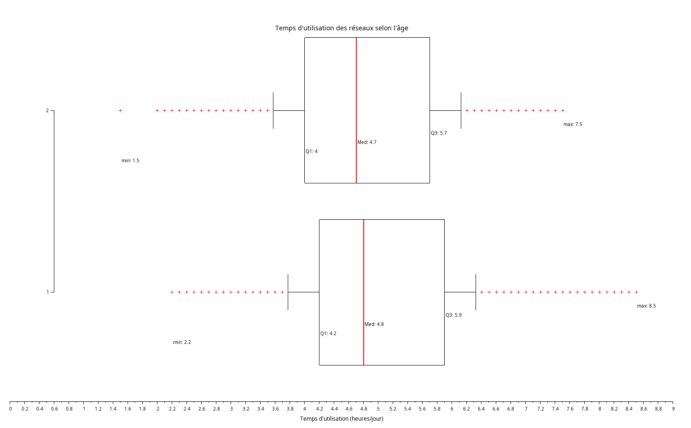
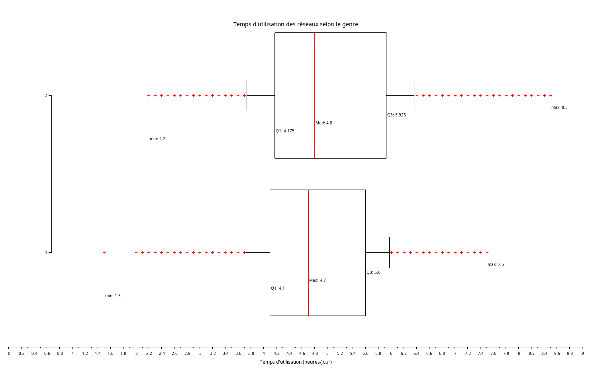
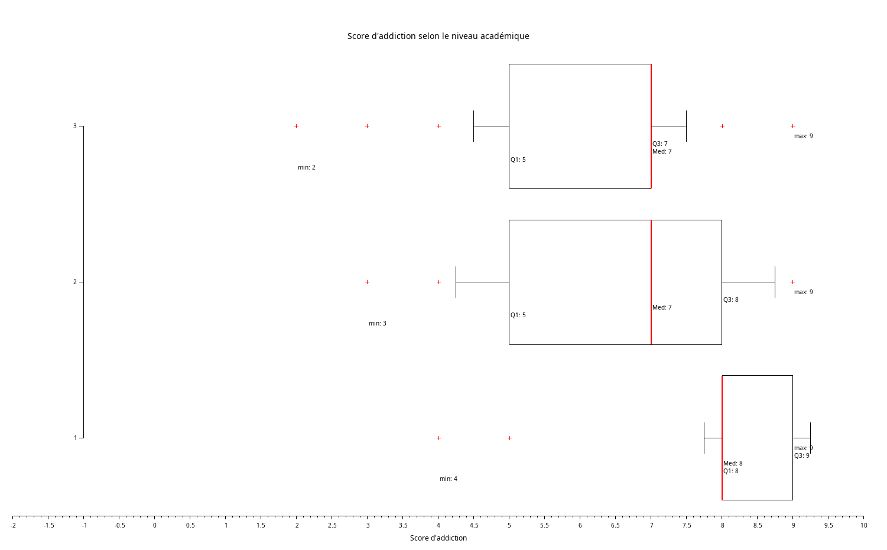

## Exercice 3 : Comparaisons graphiques

### Objectif

Comparer visuellement les comportements selon différents groupes en utilisant des **boîtes à moustaches** (`boxplot`) :

1. [Temps d’utilisation des réseaux sociaux selon deux groupes d’âge : 16-20 et 21-25](#1-temps-dutilisation-selon-les-groupes-dage-16-20-et-21-25) 
2. [Temps d’utilisation selon le **genre**](#2-temps-dutilisation-selon-le-genre)
3. [Score d’**addiction** selon le **niveau académique**](#3-score-daddiction-selon-le-niveau-académique)

---

## 1. Temps d'utilisation selon les groupes d'age 16-20 et 21-25

```scilab
data_num = csvRead("data.csv", ",");

age = data_num(:,2);
temps = data_num(:,6);


temps_16_20 = temps((age >= 16) & (age <= 20));
temps_21_25 = temps((age >= 21) & (age <= 25));


q1 = quart(temps_16_20);  min1 = min(temps_16_20);  max1 = max(temps_16_20);
q2 = quart(temps_21_25);  min2 = min(temps_21_25);  max2 = max(temps_21_25);

// Affichage console
disp("Statistiques pour les 16-20 ans :");
disp("  Min     : " + string(min1));
disp("  Q1      : " + string(q1(1)));
disp("  Médiane : " + string(q1(2)));
disp("  Q3      : " + string(q1(3)));
disp("  Max     : " + string(max1));
disp("");

disp("Statistiques pour les 21-25 ans :");
disp("  Min     : " + string(min2));
disp("  Q1      : " + string(q2(1)));
disp("  Médiane : " + string(q2(2)));
disp("  Q3      : " + string(q2(3)));
disp("  Max     : " + string(max2));

// Affichage graphique
clf();
boxplot(list(temps_16_20, temps_21_25), "orientation", "horizontal", "whisker", 0.25);
xtitle("Temps d''utilisation des réseaux selon l''âge");
xlabel("Temps d''utilisation (heures/jour)");

// groupe 16–20
xstring(min1, 1 - 0.3, "min: " + string(min1));
xstring(q1(1), 1 - 0.25, "Q1: " + string(q1(1)));
xstring(q1(2), 1 - 0.20, "Med: " + string(q1(2)));
xstring(q1(3), 1 - 0.15, "Q3: " + string(q1(3)));
xstring(max1, 1 - 0.10, "max: " + string(max1));

//  groupe 21–25
xstring(min2, 2 - 0.3, "min: " + string(min2));
xstring(q2(1), 2 - 0.25, "Q1: " + string(q2(1)));
xstring(q2(2), 2 - 0.20, "Med: " + string(q2(2)));
xstring(q2(3), 2 - 0.15, "Q3: " + string(q2(3)));
xstring(max2, 2 - 0.10, "max: " + string(max2));
```

Résultat:


Ligne 1 : [16–20] ans<br>
Ligne 2 : [21–25] ans<br>

Valeurs **min**, **Q1**, **Médiane**, **Q3** et **max** affichées.<br>
D’après le graphique, les deux groupes — 16–20 ans et 21–25 ans — passent en moyenne **presque le même temps** sur les réseaux sociaux. La médiane est à peu près identique : autour de 4,7 à 4,8 heures par jour. De plus, le minimum chez les 16–20 ans est plus élevé (2,2h contre 1,5h), ce qui veut dire que même les “moins connectés” dans ce groupe passent quand même beaucoup de temps sur les réseaux sociaux.

Enfin, on remarque de nombreuses **valeurs extrêmes** dans les deux groupes, montrant des personnes qui ont des usages très intensifs, au-delà de 7 ou 8 heures par jour.

## 2. Temps d’utilisation selon le **genre**
```scilab

data_num = csvRead("data.csv", ",");
data_str = csvRead("data.csv", ",", [], "string");

genre = stripblanks(data_str(:,3));
temps = data_num(:,6);

// Séparer par genre
temps_h = temps(genre == "Male");
temps_f = temps(genre == "Female");

// hommes
qh = quart(temps_h);
min_h = min(temps_h);
q1_h = qh(1);
med_h = qh(2);
q3_h = qh(3);
max_h = max(temps_h);

// femmes
qf = quart(temps_f);
min_f = min(temps_f);
q1_f = qf(1);
med_f = qf(2);
q3_f = qf(3);
max_f = max(temps_f);

disp("Statistiques pour les hommes :");
disp("  Min     : " + string(min_h));
disp("  Q1      : " + string(q1_h));
disp("  Médiane : " + string(med_h));
disp("  Q3      : " + string(q3_h));
disp("  Max     : " + string(max_h));
disp("");

disp("Statistiques pour les femmes :");
disp("  Min     : " + string(min_f));
disp("  Q1      : " + string(q1_f));
disp("  Médiane : " + string(med_f));
disp("  Q3      : " + string(q3_f));
disp("  Max     : " + string(max_f));

// Affichage graphique (boxplot)
clf();
boxplot(list(temps_h, temps_f), "orientation", "horizontal", "whisker", 0.25);
xtitle("Temps d''utilisation des réseaux selon le genre");
xlabel("Temps d''utilisation (heures/jour)");

xstring(min_h, 1 - 0.3, "min: " + string(min_h));
xstring(q1_h, 1 - 0.25, "Q1: " + string(q1_h));
xstring(med_h, 1 - 0.20, "Med: " + string(med_h));
xstring(q3_h, 1 - 0.15, "Q3: " + string(q3_h));
xstring(max_h, 1 - 0.10, "max: " + string(max_h));

xstring(min_f, 2 - 0.3, "min: " + string(min_f));
xstring(q1_f, 2 - 0.25, "Q1: " + string(q1_f));
xstring(med_f, 2 - 0.20, "Med: " + string(med_f));
xstring(q3_f, 2 - 0.15, "Q3: " + string(q3_f));
xstring(max_f, 2 - 0.10, "max: " + string(max_f));
```
Résultat: 

Ligne 1 : hommes<br>
Ligne 2 : femmes<br>

Les femmes présentent un temps d’utilisation des réseaux sociaux **légèrement plus élevé que les hommes**, avec une médiane supérieure (4.8 h contre 4.7 h) et un maximum plus haut (8.5 h contre 7.5 h).

Contrairement à ce qu’on pourrait penser, ce sont les femmes qui montrent une **variabilité centrale** plus importante, avec un écart interquartile (IQR) de 1.75 h contre 1.5 h chez les hommes. Cela signifie que, bien que leur utilisation soit globalement plus élevée, elle est aussi **moins homogène** autour de la médiane.

## 3. Score d’**addiction** selon le **niveau académique**

```scilab
data_num = csvRead("data.csv", ",");
data_str = csvRead("data.csv", ",", [], "string");

niveau = stripblanks(data_str(:,4));
score = data_num(:,13);

score_hs = score(niveau == "High School");
score_ug = score(niveau == "Undergraduate");
score_g  = score(niveau == "Graduate");

// Calcul:High School
qh = quart(score_hs);
min_hs = min(score_hs);
q1_hs = qh(1); med_hs = qh(2); q3_hs = qh(3);
max_hs = max(score_hs);

// Calcul:Undergraduate
qu = quart(score_ug);
min_ug = min(score_ug);
q1_ug = qu(1); med_ug = qu(2); q3_ug = qu(3);
max_ug = max(score_ug);

// Calcul :Graduate
qg = quart(score_g);
min_g = min(score_g);
q1_g = qg(1); med_g = qg(2); q3_g = qg(3);
max_g = max(score_g);

disp("Statistiques - High School :");
disp("  Min     : " + string(min_hs));
disp("  Q1      : " + string(q1_hs));
disp("  Médiane : " + string(med_hs));
disp("  Q3      : " + string(q3_hs));
disp("  Max     : " + string(max_hs));
disp("");

disp("Statistiques - Undergraduate :");
disp("  Min     : " + string(min_ug));
disp("  Q1      : " + string(q1_ug));
disp("  Médiane : " + string(med_ug));
disp("  Q3      : " + string(q3_ug));
disp("  Max     : " + string(max_ug));
disp("");

disp("Statistiques - Graduate :");
disp("  Min     : " + string(min_g));
disp("  Q1      : " + string(q1_g));
disp("  Médiane : " + string(med_g));
disp("  Q3      : " + string(q3_g));
disp("  Max     : " + string(max_g));

clf();
boxplot(list(score_hs, score_ug, score_g), "orientation", "horizontal", "whisker", 0.25);
xtitle("Score d''addiction selon le niveau académique");
xlabel("Score d''addiction");

// High School
xstring(min_hs, 1 - 0.3, "min: " + string(min_hs));
xstring(q1_hs, 1 - 0.25, "Q1: " + string(q1_hs));
xstring(med_hs, 1 - 0.20, "Med: " + string(med_hs));
xstring(q3_hs, 1 - 0.15, "Q3: " + string(q3_hs));
xstring(max_hs, 1 - 0.10, "max: " + string(max_hs));

// Undergraduate
xstring(min_ug, 2 - 0.3, "min: " + string(min_ug));
xstring(q1_ug, 2 - 0.25, "Q1: " + string(q1_ug));
xstring(med_ug, 2 - 0.20, "Med: " + string(med_ug));
xstring(q3_ug, 2 - 0.15, "Q3: " + string(q3_ug));
xstring(max_ug, 2 - 0.10, "max: " + string(max_ug));

//Graduate
xstring(min_g, 3 - 0.3, "min: " + string(min_g));
xstring(q1_g, 3 - 0.25, "Q1: " + string(q1_g));
xstring(med_g, 3 - 0.20, "Med: " + string(med_g));
xstring(q3_g, 3 - 0.15, "Q3: " + string(q3_g));
xstring(max_g, 3 - 0.10, "max: " + string(max_g));
```
Résultat:<br>
<br>

1 = High School<br>
2 = Undergraduate<br>
3 = Graduate<br>

Les trois **boîtes à moustaches** illustrent la répartition des scores d’addiction aux réseaux sociaux selon le niveau d'études des individus. Les lycéens (High School) présentent une médiane située à 7, avec une répartition modérée allant de 5 à 7, et quelques valeurs (très peu) en dehors de cet intervalle. Cela indique un niveau d’addiction globalement élevé, mais cela reste **hétérogène**.

Chez les étudiants de niveau Undergraduate, la médiane reste également à 7, mais la boîte s’étend de 5 à 8, indiquant une variabilité plus importante dans les scores d’addiction. Cela suggère une population plus diverse en termes de rapport aux réseaux sociaux, avec des comportements allant de l’usage modéré à l’usage intensif.

Enfin, les étudiants de niveau Graduate présentent une boîte très resserrée, de 8 à 9, avec une médiane à 8, et peu de valeurs extrêmes. Cela traduit un niveau d’addiction élevé et très homogène, laissant penser que l’usage intensif des réseaux est quasi **généralisé** à ce stade d’étude.


