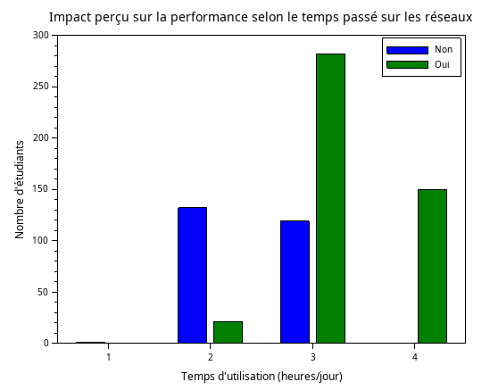

## Exercice 4 : Impact de la durée d'utilisation des réseaux sur la performance académique

### Objectif

Comparer graphiquement les performances académiques selon quatre groupes de durée d’utilisation des réseaux sociaux :

- Faible utilisation : 0 à 2 heures
- Utilisation modérée : 2 à 4 heures
- Utilisation élevée : 4 à 6 heures
- Utilisation très élevée : 6 à 12 heures

```scilab

data_num = csvRead("data.csv", ",");
data_str = csvRead("data.csv", ",", [], "string");
temps = data_num(:,6);
impact = stripblanks(data_str(:,8));
g1 = (temps >= 0) & (temps < 2);
g2 = (temps >= 2) & (temps < 4);
g3 = (temps >= 4) & (temps < 6);
g4 = (temps >= 6) & (temps <= 12);
yes_no = [
    sum(impact(g1) == "No"),  sum(impact(g1) == "Yes");
    sum(impact(g2) == "No"),  sum(impact(g2) == "Yes");
    sum(impact(g3) == "No"),  sum(impact(g3) == "Yes");
    sum(impact(g4) == "No"),  sum(impact(g4) == "Yes")
];
disp(yes_no);
clf();
bar(yes_no);
xtitle("Impact perçu sur la performance selon le temps passé sur les réseaux");
xlabel("Temps d''utilisation (heures/jour)");
ylabel("Nombre d''étudiants");
legend(["Non", "Oui"], "upper_right");

```

Résultat:<br>  


1 :**0 à moins de 2 heures**<br> 
2 :**2 à moins de 4 heures**<br>
3 :**4 à moins de 6 heures** <br>
4 :**6 à 12 heures**<br>


Ce graphique indique une corrélation entre le temps passé sur les réseaux et l'impact sur la performance académique. Pour la majorité de ceux qui utilisent les réseaux moins de 4 heures par jour, beaucoup ne ressentent **aucun impact**. Or, dès que le **cap des 4 heures par jour** est passé, une **majorité écrasante** d'étudiants déclare que l'utilisation des réseaux sociaux impacte leurs performances scolaires.


On conclut qu'à un certain degré, l'utilisation des réseaux sociaux devient **nuisible** aux étudiants.