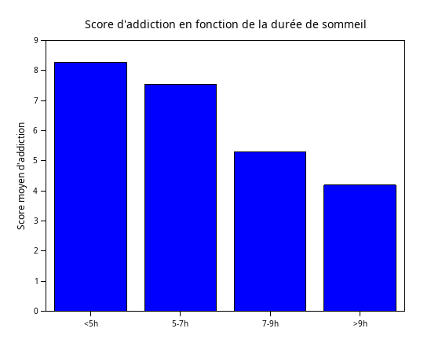

# Exercice 5 : Score d'addiction en fonction de la durée de sommeil

### Objectif

Comparer graphiquement le score d'addiction des étudiants en fonction de leur durée de sommeil.  
Les étudiants sont regroupés selon les intervalles suivants :

- Moins de 5h : `<5h`
- Entre 5h et 7h : `5-7h`
- Entre 7h et 9h : `7-9h`
- Plus de 9h : `>9h`

---


```scilab
data = csvRead("data.csv", ",");
sommeil = data(:, 9);
addiction = data(:, 13);
moyennes = zeros(1, 4);
moyennes(1) = mean(addiction(sommeil < 5));
moyennes(2) = mean(addiction(sommeil >= 5 & sommeil < 7));
moyennes(3) = mean(addiction(sommeil >= 7 & sommeil < 9));
moyennes(4) = mean(addiction(sommeil >= 9));
disp(moyennes);
clf();
bar(moyennes);
xtitle("Score d''addiction en fonction de la durée de sommeil");
ylabel("Score moyen d''addiction");
axes = gca();
axes.x_ticks.labels = ["<5h", "5-7h", "7-9h", ">9h"]';
show_window();
```
Résultat:<br>


Les étudiants étant addict à 8/10 par exemple, dorment moins de 5 heures par nuit, tandis que ceux qui présentent un score d'addiction à 4-5/10, dorment facilement 9 heures par nuit.
Ce graphe sous forme de barres nous montre alors que **plus l'on est addict aux réseaux sociaux, moins l'on dort**.<br>
Cette information peut sembler évidente : plus on est addict, plus on passe de temps sur les réseaux, plus on se couche tard.