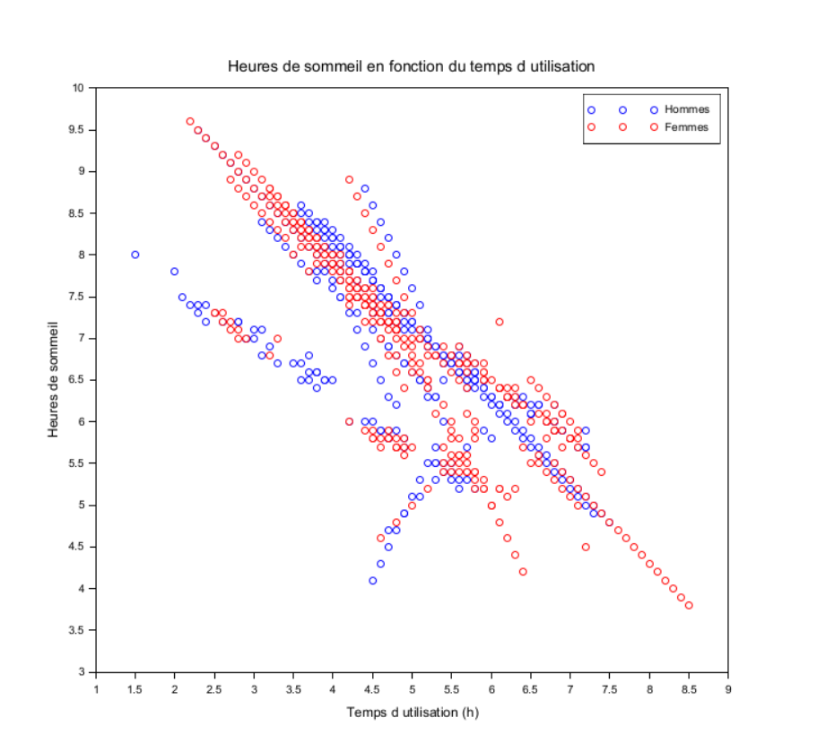
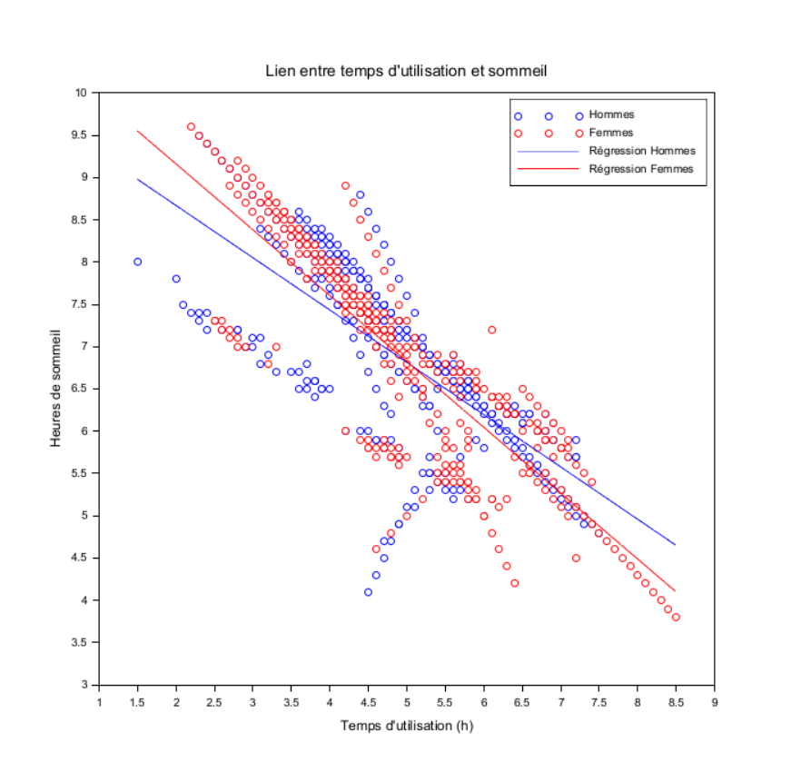
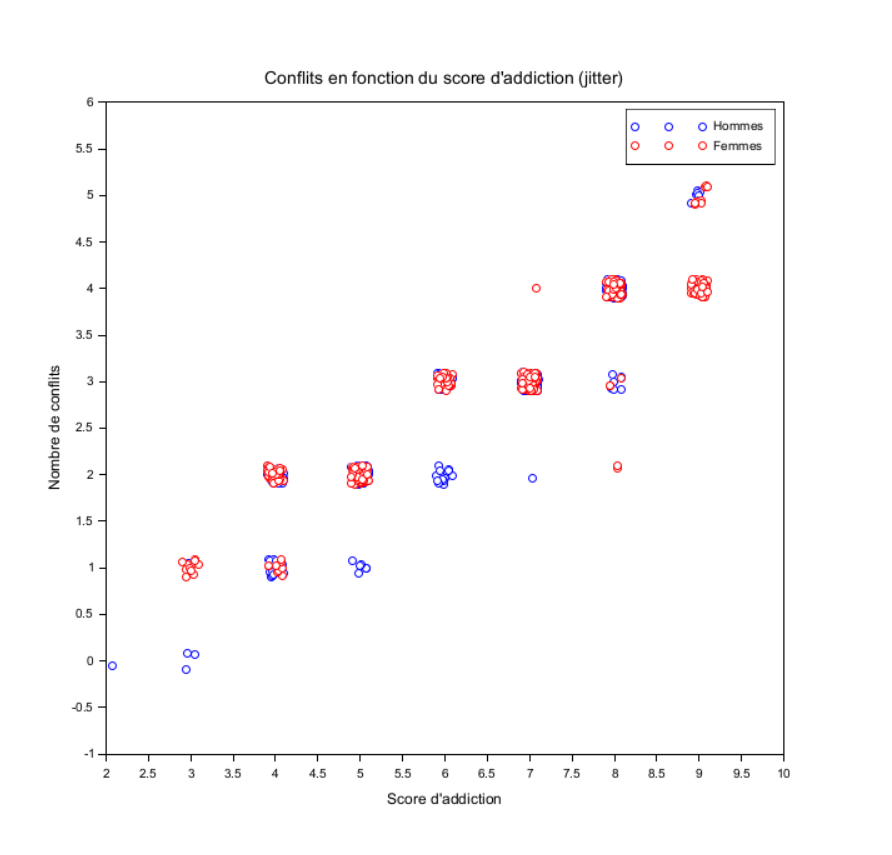

# Exercice 6 : Sommeil, conflits et addiction ?

## Table des matières
- [Initialisation des variables](#a-initialisation-des-variables)  
- [Sommeil en fonction du temps d'utilisation](#1-sommeil-en-fonction-du-temps-dutilisation)  
- [Correlation](#2-correlation)  
- [Lien entre les conflits et l'addiction](#3-lien-entre-les-conflits-et-laddiction)  

---

## a. Initialisation des variables

```scilab
csv = csvRead('data.csv',',');
data = csvRead('data.csv', ",", [], "string") 
```

## 1: Sommeil en fonction du temps d'utilisation

```scilab
genre  = stripblanks(strsubst(data(:,3), """", ""));   
usage  = strtod(stripblanks(strsubst(data(:,6), """", "")));
sleep  = strtod(stripblanks(strsubst(data(:,9), """", ""))); 

valid = ~isnan(usage) & ~isnan(sleep);

genre  = genre(valid);
usage  = usage(valid);
sleep  = sleep(valid);

hommes = (genre == "Male");
femmes = (genre == "Female");

clf();
plot(usage(hommes), sleep(hommes), 'bo');  // hommes en bleu
plot(usage(femmes), sleep(femmes), 'ro');  // femmes en rouge
legend(["Hommes", "Femmes"], "in_upper_right");
xtitle("Heures de sommeil en fonction du temps d utilisation", "Temps d utilisation (h)", "Heures de sommeil");
```

Résultat:<br>


Sous la forme de **nuages de points**, ce graphe nous indique le temps de sommeil de chacun en fonction du temps et du genre. Les données associées aux femmes sont en rouge et celles qui correspondent aux hommes en bleu. On y voit clairement une **diminution** du temps de sommeil : **plus l'on passe du temps sur les réseaux sociaux (homme ou femme), moins l'on dort**. Chaque point représente un individu, plusieurs points peuvent être confondus.

## 2: Correlation 

```
genre  = stripblanks(strsubst(data(:,3), """", ""));
usage  = strtod(stripblanks(strsubst(data(:,6), """", "")));
sleep  = strtod(stripblanks(strsubst(data(:,9), """", "")));

valid = ~isnan(usage) & ~isnan(sleep);
genre = genre(valid);
usage = usage(valid);
sleep = sleep(valid);

hommes = (genre == "Male");
femmes = (genre == "Female");

x_h = usage(hommes);
y_h = sleep(hommes);
x_f = usage(femmes);
y_f = sleep(femmes);

mxh = mean(x_h); myh = mean(y_h);
mxf = mean(x_f); myf = mean(y_f);

b_h = sum((x_h - mxh).*(y_h - myh)) / sum((x_h - mxh).^2);
a_h = myh - b_h * mxh;

b_f = sum((x_f - mxf).*(y_f - myf)) / sum((x_f - mxf).^2);
a_f = myf - b_f * mxf;

clf();
plot(x_h, y_h, 'bo'); // points hommes
plot(x_f, y_f, 'ro'); // points femmes

x = linspace(min(usage), max(usage), 100);
plot(x, a_h + b_h*x, 'b-');
plot(x, a_f + b_f*x, 'r-');

legend(["Hommes", "Femmes", "Régression Hommes", "Régression Femmes"], "in_upper_right");
xtitle("Lien entre temps d''utilisation et sommeil", "Temps d''utilisation (h)", "Heures de sommeil");

mprintf("Régression Hommes : y = %.2f + %.2f*x\n", a_h, b_h);
mprintf("Régression Femmes : y = %.2f + %.2f*x\n", a_f, b_f);
```

Résultat:<br>


Pour tenter de prouver qu'il y a un lien entre ces deux séries statistiques, nous calculons les **coefficients de régression** pour les deux sous groupes. Ces deux coefficients sont négatifs, la corrélation entre le temps d'utilisation des réseaux sociaux et le temps de sommeil est donc elle aussi **négative** : on trace sur ce graphe les deux **droites de régression** correspondantes.
On constate que celle des femmes a une plus grande pente, elles sont donc plus impactées que les hommes par ce phénomène de baisse de sommeil par rapport au temps d'utilisation des réseaux sociaux. <br>
**Il existe bien un lien entre ces deux séries statistiques.**


## 3: Lien entre les conflits et l'addiction
```scilab
genre      = stripblanks(strsubst(data(:,3), """", ""));
addiction  = strtod(stripblanks(strsubst(data(:,13), """", "")));
conflicts  = strtod(stripblanks(strsubst(data(:,12), """", "")));

valid = ~isnan(addiction) & ~isnan(conflicts);
genre     = genre(valid);
addiction = addiction(valid);
conflicts = conflicts(valid);

hommes = (genre == "Male");
femmes = (genre == "Female");

rand("seed", 0); // pour reproductibilité
jitter_x = 0.2 * (rand(addiction) - 0.5);
jitter_y = 0.2 * (rand(conflicts) - 0.5);

x_h = addiction(hommes) + jitter_x(hommes);
y_h = conflicts(hommes) + jitter_y(hommes);
x_f = addiction(femmes) + jitter_x(femmes);
y_f = conflicts(femmes) + jitter_y(femmes);

clf();
plot(x_h, y_h, 'bo'); // hommes
plot(x_f, y_f, 'ro'); // femmes

legend(["Hommes", "Femmes"], "in_upper_right");
xtitle("Conflits en fonction du score d''addiction (jitter)", "Score d''addiction", "Nombre de conflits");
```

Résultat:<br>


Ce graphe illustre le lien entre les conflits et le score d'addiction : chaque point représente un individu. Etant donné que les valeurs sont souvent confondues, nous avons décidé de les présenter sous forme de **jitter**, ce qui permet aussi de voir la concentration les plus grandes. 
Il semble alors que **plus nous sommes addicts, plus nous serons confrontés à des conflits** et que les femmes sont plus addictes et plus conflictueuses.
