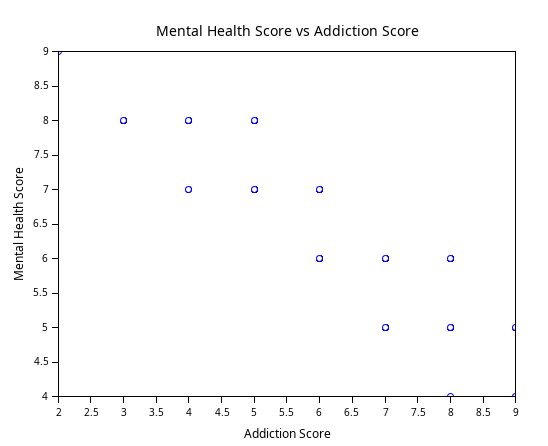
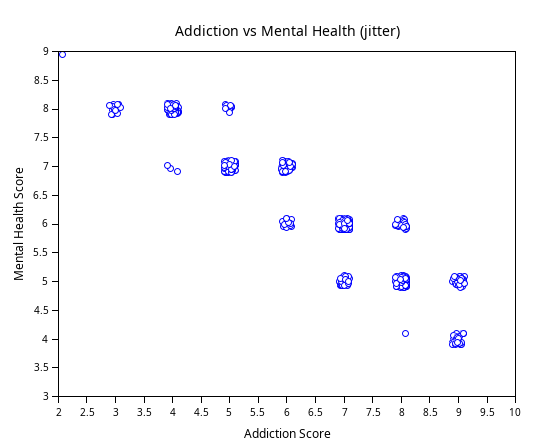

### Exercice 7 


La comparaison que nous avons choisie est le lien entre la **santé mentale** et l'**addiction**. Quel est l'impact des réseaux sociaux sur les étudiants de cette étude ?

```scilab
data = csvRead("data.csv", ",", [], "string");

ment_raw = stripblanks(strsubst(data(:,10), """", ""));
add_raw  = stripblanks(strsubst(data(:,13), """", ""));

ment_score = strtod(ment_raw);
add_score  = strtod(add_raw);

clf();
plot(add_score, ment_score, 'o');
xtitle("Mental Health Score vs Addiction Score", "Addiction Score", "Mental Health Score");
```

Résultat:<br>



Avec un jitter :
```scilab
data = csvRead("data.csv", ",", [], "string");

add_raw  = stripblanks(strsubst(data(:,13), """", ""));
ment_raw = stripblanks(strsubst(data(:,10), """", ""));

add_score  = strtod(add_raw);
ment_score = strtod(ment_raw);

ok = find(~(isnan(add_score) | isnan(ment_score)));
AS = add_score(ok); 
MS = ment_score(ok);  

n   = size(AS, "r");         
j_x = (rand(n, 1) - 0.5) * 0.2;  
j_y = (rand(n, 1) - 0.5) * 0.2;  

clf();
plot(AS + j_x, MS + j_y, 'o');
xtitle("Addiction vs Mental Health (jitter)", "Addiction Score", "Mental Health Score");
```
Résultat: <br>


On distingue une **diminution constante** de la santé mentale en fonction du degré d'addiction. En effet, il semblerait que **plus les étudiants sont addicts, plus leur santé mentale est mauvaise**. Ceci n'est pas étonnant, la science ayant prouvé que passer trop de temps sur les réseaux sociaux augmente les sentiments de **stress**, de **colère**, de **dépression** et même d'**agressivité** (ce qui expliquerait les conflits).